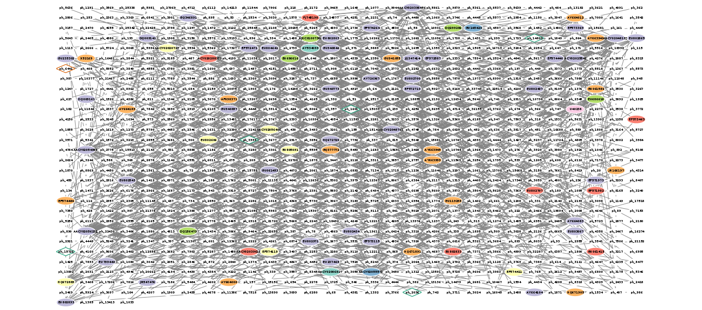
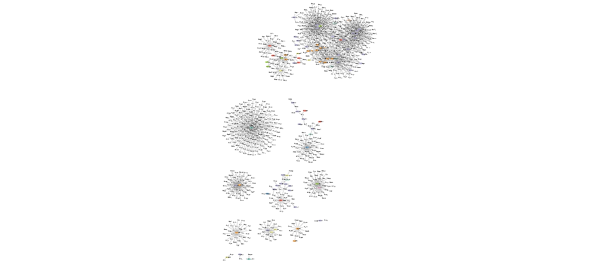

# Co-occurence network visualisation using RCy3 and Cytoscape
Julia Gustavsen  
July 17th 2016  

# Get set up

```r
library(RCy3)
library(RColorBrewer)
```


```r
cy <- CytoscapeConnection()
```

# Send network to Cytoscape


```r
load(file = "./data/network.gpl", verbose = TRUE)
```

```
## Loading objects:
##   ug
```

```r
cw <- CytoscapeWindow("Tara oceans",
                      graph = ug,
                      overwriteWindow = TRUE)
displayGraph(cw)
```

```
## [1] "phage_aff"
## [1] "Tax_order"
## [1] "Tax_subfamily"
## [1] "prok_king"
## [1] "prok_tax_phylum"
## [1] "prok_tax_class"
## [1] "label"
## [1] "Weight"
```

```r
layoutNetwork(cw)
```

Show network first


```r
saveImage(cw,
          "co-occur0",
          "png",
          scale=1)

saveImage(cw,
          "co-occur0",
          "pdf",
          scale=1)
```



Colour network

```r
families_to_colour <- unlist(unique(nodeData(ug, attr="prok_tax_phylum")))
families_to_colour <- families_to_colour[!families_to_colour %in% "test"]
node.colour <- brewer.pal(length(families_to_colour),
                          "Set3")
setNodeColorRule(cw,
                 'prok_tax_phylum',
                 families_to_colour,
                 node.colour,
                 "lookup",
                 default.color='#ffffff')
```

```
## Successfully set rule.
```

```r
displayGraph(cw)
```

```
## [1] "phage_aff"
## [1] "Tax_order"
## [1] "Tax_subfamily"
## [1] "prok_king"
## [1] "prok_tax_phylum"
## [1] "prok_tax_class"
## [1] "label"
## [1] "Weight"
```


Show network first


```r
saveImage(cw,
          "co-occur0_1",
          "png",
          scale=1)

saveImage(cw,
          "co-occur0_1",
          "pdf",
          scale=1)
```


```r
## set shape to be virus or prok
shapes_for_nodes <- c('DIAMOND')

## so want to grep for ph
phage_names <- grep("ph_", nodes(ug), value=TRUE)
setNodeShapeRule(cw,
                 "label",
                 phage_names,
                 shapes_for_nodes)
```

```
## Successfully set rule.
```

```r
showGraphicsDetails(cw, new.value)
```

```
## RCy3::showGraphicsDetails(), Switching between show and hide full graphics details.
```

```r
displayGraph(cw)
```

```
## [1] "phage_aff"
## [1] "Tax_order"
## [1] "Tax_subfamily"
## [1] "prok_king"
## [1] "prok_tax_phylum"
## [1] "prok_tax_class"
## [1] "label"
## [1] "Weight"
```


```r
saveImage(cw,
          "co-occur1",
          "png",
          scale=1)

saveImage(cw,
          "co-occur1",
          "pdf",
          scale=1)
```


colour edges of phage

```r
setDefaultNodeBorderWidth(cw, 5)
families_to_colour <- c(" Podoviridae",
                        " Siphoviridae",
                        " Myoviridae")
node.colour <- brewer.pal(length(families_to_colour),
                          "Dark2")
setNodeBorderColorRule(cw,
                 'Tax_subfamily',
                 families_to_colour,
                 node.colour,
                 "lookup", 
                 default.color = "#FFFFFF")
```

```
## Successfully set rule.
```

```r
displayGraph(cw)
```

```
## [1] "phage_aff"
## [1] "Tax_order"
## [1] "Tax_subfamily"
## [1] "prok_king"
## [1] "prok_tax_phylum"
## [1] "prok_tax_class"
## [1] "label"
## [1] "Weight"
```


```r
saveImage(cw,
          "co-occur2",
          "png",
          scale=1)

saveImage(cw,
          "co-occur2",
          "pdf",
          scale=1)
```


Do more layout

```r
setLayoutProperties(cw, layout.name = 'allegro-spring-electric', list( gravity = 100,
                                                                     scale = 6))
```

```
## Successfully updated the property 'gravity'.
## Successfully updated the property 'scale'.
```

```r
layoutNetwork(cw, layout.name = 'allegro-spring-electric')
```


```r
saveImage(cw,
          "co-occur3",
          "png",
          scale=1)

saveImage(cw,
          "co-occur3",
          "pdf",
          scale=1)
```


